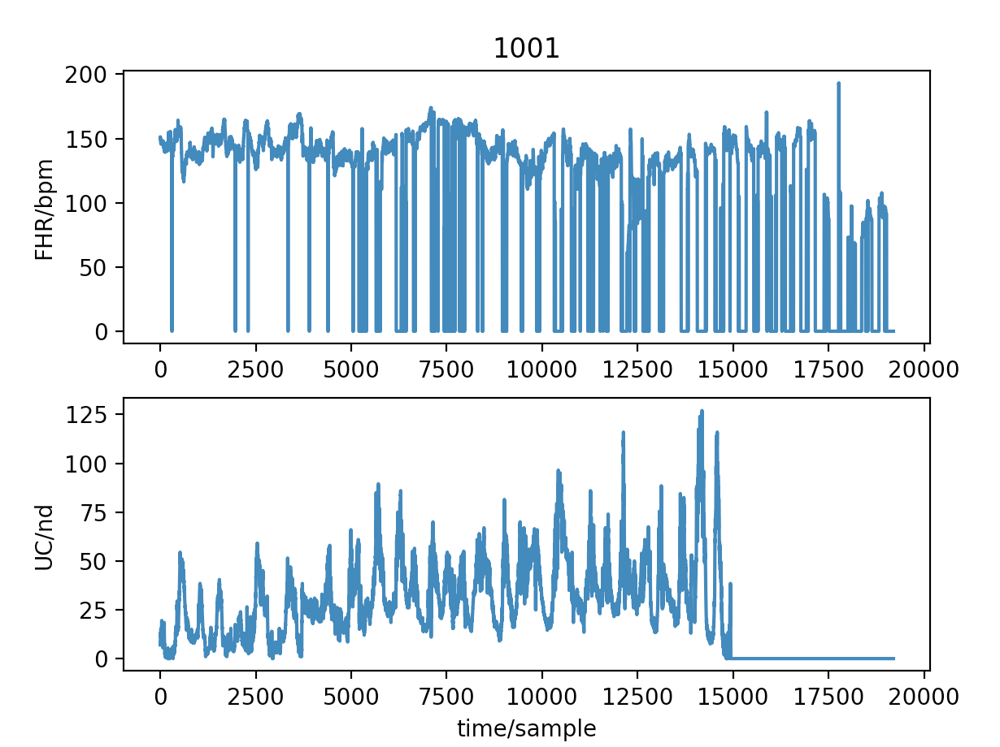

# save-the-babies
General utilities for reading fetal cardiotocography data from https://physionet.org/content/ctu-uhb-ctgdb/1.0.0/

## Read Waveform files from Physionet.org

Get the wavefrm data from the physionet archive:

`wget --recursive --no-parent https://physionet.org/physiobank/database/ctu-uhb-ctgdb/`

Read them into python:

`python read_physionet.py --files physiobank/database/ctu-uhb-ctgdb/ --title 1001`

## Convert pdf's to individual pngs

`brew install ghostscript`
 
`gs -dNOPAUSE -sDEVICE=png16m -r256 -sOutputFile=myData/page%03d.png myData.pdf`

(you may need to type `quit` once the GS prompt is returned)

## Clip out part of a png and use the same crop bounds for all additional pngs in a path

`python clip_bounds.py --file myData/page0004.png --path myData/`

When the image is displayed, the mouse is used to interact with the region of interest. Click on the top left and hold/darg to bottom right. Release. Press 'c' if oyu want to crop the window. Press 'r' to redo. Everything in the `--path` will be corpped accordingly to the same window.

Output cropped images are stored in `myData/clipped/` (or whatever your specified top level path is above).
